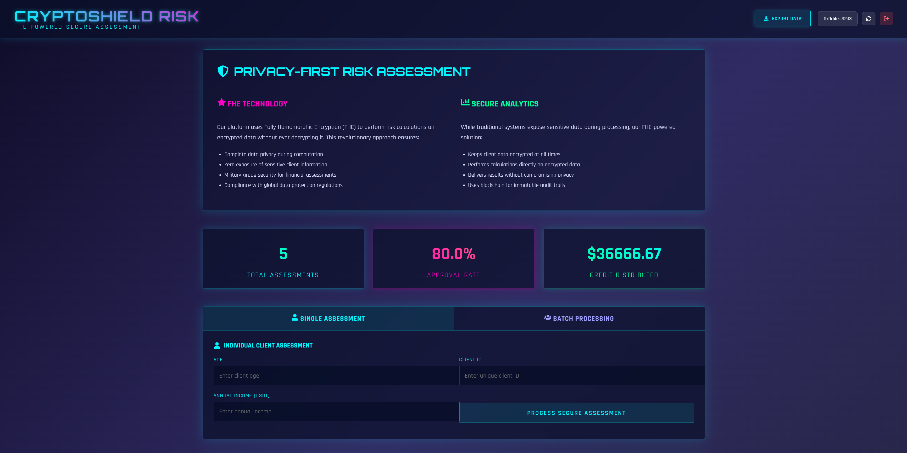

# FHE Risk Assessment Platform

A fully homomorphic encryption (FHE) enabled risk assessment system on FHEVM, providing transparent and verifiable financial risk analysis on-chain while ensuring complete data privacy and compliance.

---

## Live Demo

Try the live application: [https://zama-fhe-riskControl.vercel.app/](https://zama-fhe-riskControl.vercel.app/)




---

## Project Background  

In today's financial landscape, accurate risk assessment is crucial for credit decisions and regulatory compliance. However, traditional risk assessment systems face significant challenges:

- **Data privacy concerns:** Sensitive client information is exposed during processing
- **Compliance risks:** Handling personal financial data requires strict regulatory adherence
- **Lack of transparency:** Clients cannot verify how their risk profiles are calculated
- **Data tampering risks:** Assessment results could be manipulated after calculation

FHE Risk Assessment leverages Fully Homomorphic Encryption (FHE) technology to tackle these issues. By performing computations on encrypted data directly on-chain, the system ensures:

- Complete privacy of client data throughout the assessment process
- Regulatory compliance with data protection standards
- Transparent and verifiable risk calculations
- Immutable records that cannot be altered after assessment
- Trustless environment where results can be verified by anyone

---

## Features

### Core Functionality

- **Privacy-Preserving Risk Assessment:** Analyze client risk profiles without exposing sensitive data
- **Single & Batch Processing:** Assess individual clients or process multiple clients simultaneously
- **Real-time Results:** Instant calculation of credit limits, risk scores, and approval status
- **Administrative Controls:** Update risk parameters and manage contract ownership
- **FHEVM Integration:** On-chain data encryption ensures trust and integrity
- **Data Export:** Download assessment results in CSV format for analysis

### Privacy & Security

- **Fully Encrypted Processing:** Client data remains encrypted throughout computation
- **Zama FHE Technology:** Industry-leading fully homomorphic encryption
- **Immutable Records:** Assessment data cannot be modified after calculation
- **Pseudonymous Identifiers:** Client privacy maintained through unique IDs
- **Wallet Authentication:** Secure access control through Ethereum wallets

---

## Architecture

### Smart Contracts

**RiskControl.sol - Main Contract**

- Manages client risk assessments using FHE operations
- Stores encrypted assessment results on-chain
- Provides admin functions for parameter updates
- Handles batch processing of multiple clients
- Maintains pseudonymous client identifiers for compliance

### Frontend Application

- **React + TypeScript:** Modern user interface with cyberpunk theme
- **Ethers.js:** Blockchain interaction
- **Vite:** Fast build and hot reload
- **Wallet Integration:** Connect various Ethereum wallets
- **Responsive Design:** Works on desktop and mobile devices
- **Real-time Updates:** Instant reflection of new assessments and statistics
- **Data Visualization:** Interactive display of assessment results

---

## Technology Stack

### Blockchain

- **Solidity ^0.8.24:** Smart contract development
- **Zama FHE:** Fully Homomorphic Encryption library
- **FHEVM:** Fully Homomorphic Encryption Virtual Machine
- **OpenZeppelin:** Secure contract libraries
- **Hardhat:** Development and deployment framework

### Frontend

- **React 18 + TypeScript**
- **Vite:** Build tool and dev server
- **Ethers.js:** Ethereum interaction
- **TSParticles:** Interactive particle background effects
- **React Icons:** UI icon library
- **Cyberpunk UI Design:** Futuristic interface with neon accents

### Infrastructure

- **Vercel:** Frontend deployment
- **Sepolia Testnet:** Development and testing environment

---

## Installation

### Prerequisites

- Node.js 20+
- npm / yarn / pnpm
- Ethereum wallet (MetaMask recommended)

### Setup

```bash
# Clone the repository
git clone https://github.com/be-autiful72/zama-fhe-riskControl.git
cd zama-fhe-riskControl

# Install dependencies
npm install

# Install development dependencies
npm install --save-dev @nomicfoundation/hardhat-toolbox

# Install additional required packages
npm install @zama-fhe/relayer-sdk
npm install ethers dotenv
npm install react react-dom

# Compile contracts
npx hardhat compile

# Deploy to network (configure hardhat.config.js first)
npx hardhat run deploy/deploy.ts --network sepolia

# Start the development server
cd frontend

npm install
npm install lucide-react
npm install react react-dom
npm install react-icons
npm install react-tsparticles tsparticles

npm run dev   
```

## Usage

- **Connect Wallet:** Click the "Connect Wallet" button and select your preferred Ethereum wallet
- **Single Assessment:** Enter client age, income, and ID to perform individual risk assessment
- **Batch Processing:** Submit multiple client assessments in bulk using the batch format
- **View Results:** See assessment results including credit limit, risk score, and approval status
- **Export Data:** Download assessment results in CSV format for further analysis
- **Update Parameters (Admin):** Adjust risk calculation parameters (admin only)

## Security Features

- All client data is encrypted using FHE before processing
- Sensitive information never decrypted during computation
- Pseudonymous client identifiers protect client identity
- Assessment results stored immutably on-chain
- Transparent risk calculation process

## Future Enhancements

- Advanced risk modeling with additional parameters
- Customizable risk calculation algorithms
- Integration with credit bureau APIs (with FHE protection)
- Multi-chain deployment for broader accessibility
- Client portal for self-service risk assessment
- AI-powered risk prediction models